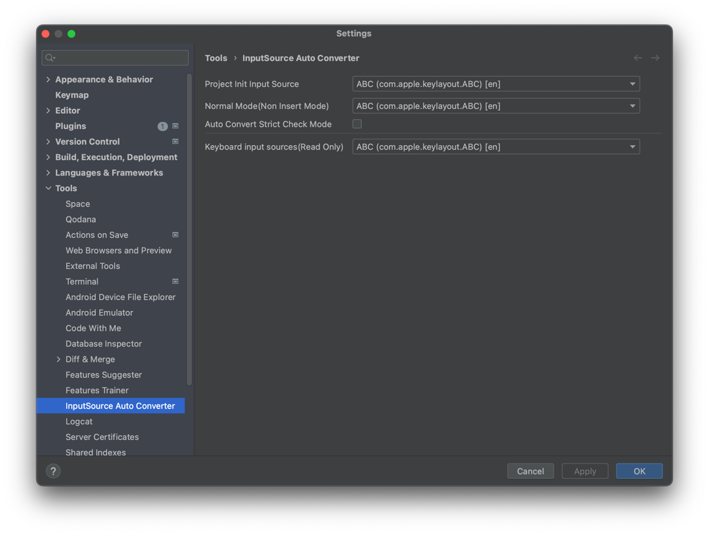

# InputSource Auto Converter

In IdeaVim, non-english key inputs don't use in normal mode, causing the intended commands to not be input correctly.

This plugin is helpful when using IdeaVim in a non-english environment. It assists in situations where you forget to switch to english while typing non-english in insert mode.

## Feature

> `Settings > Tools > InputSource Auto Converter`

### Automatically convert to set english input source in project open

When opening the project, input source initializes with the set `Project init Input Source` in setting panel.

### Automatically convert to set english input source in insert mode to another mode

When transitioning from Insert Mode to Non-Insert Modes(Command Mode, Visual Mode, Select Mode, ...), this plugin automatically converts to the set `Normal Mode Input Source` in setting panel.

If you forget to switch back to english after using non-english in insert mode, this plugin automatically converts to english in non-insert mode.

### Strict mode forces an english input source in code editor when non-insert mode.

Strict mode configures the input source to fixed in the code editor when not in Insert Mode.

If editor receives non-english input source changed from another place, it automatically converts to set input source.

## Installation

Go to `Settings > Plugins > Marketplace` and searching `InputSource Auto Converter`.

## Supported

- Currently, only supports macOS
- Only supports the default input method provided by OS

## Recommend plugin that work well together

### [LangCursor](https://plugins.jetbrains.com/plugin/23464-langcursor)

this plugin visually changes the color of the cursor when the input is non-english.
